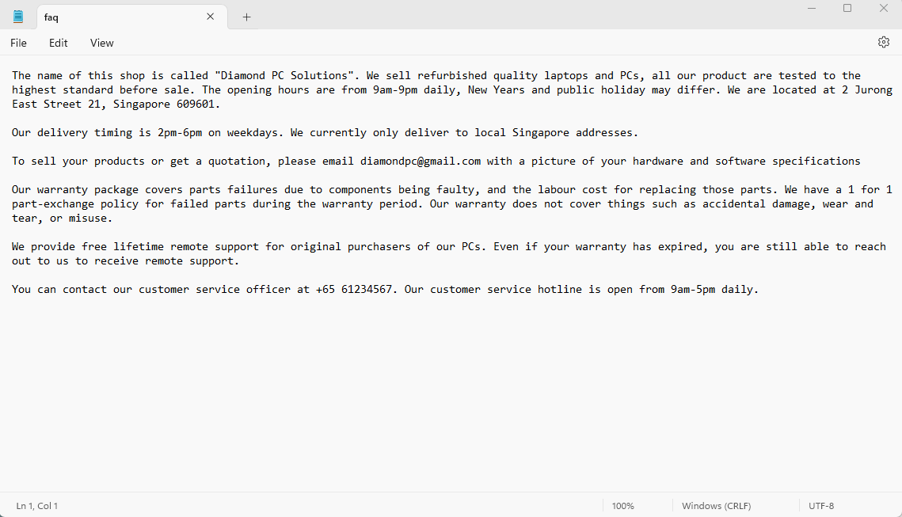

## MichaelQnA

### Inspiration
We thought about increasing productivity in a workplace for customer service personnels. Everyday, hundreds of calls are being made to customer service call centers. Out of all the queries made, many can be answered by a simple FAQ section.

### What is our solution
We decided to create an AI powered telegram bot to answer common questions posed by customers. This helps to ensure that customer service personnels to focus on the more important queries and cases instead of having to answer similarly repeated questions by customers.

### How it works
This script sets up the telegram bot MichaelQnA (@TeleMichaelBot). It uses the python library telebot to create the telegram bot and DistilBERT base cased distilled SQuAD model from HuggingFace to learn the input context and provide a response to user's query based on the context. 

User queries can be in the form of a text input or a voice message on telegram. SpeechRecognition is used to transcribe the voice message into text before loading 
the user query into the DistilBERT model.

Example of a context txt file

This txt file contains the context which allows the AI model to draw information from. This file can be edited to suit the business' needs

### Relevant Info
pyTelegramBotAPI: https://pytba.readthedocs.io/en/latest/index.html

SpeechRecognition: https://github.com/Uberi/speech_recognition#readme

DistilBERT base cased distilled SQuAD: https://huggingface.co/distilbert-base-cased-distilled-squad

