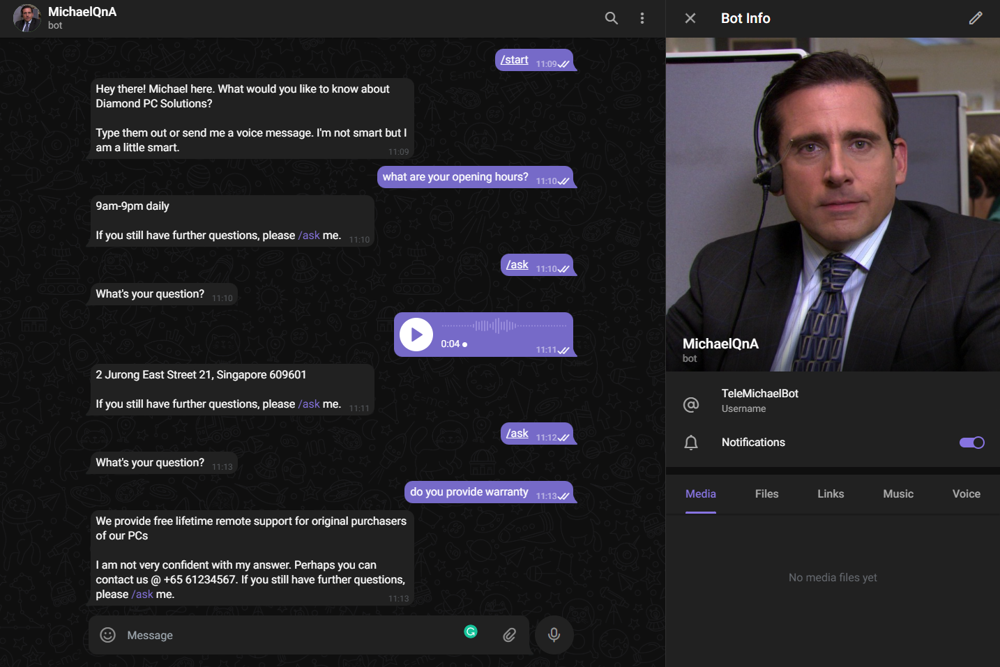

## MichaelQnA

This script sets up the telegram bot MichaelQnA (@TeleMichaelBot). It uses the python library telebot to create the telegram bot and DistilBERT base cased distilled SQuAD model 
from HuggingFace to learn the input context and provide a response to user's query based on the context. 

User queries can be in the form of a text input or a voice message on telegram. SpeechRecognition is used to transcribe the voice message into text before loading 
the user query into the DistilBERT model.

### Relevant Info

pyTelegramBotAPI: https://pytba.readthedocs.io/en/latest/index.html

SpeechRecognition: https://github.com/Uberi/speech_recognition#readme

DistilBERT base cased distilled SQuAD: https://huggingface.co/distilbert-base-cased-distilled-squad

